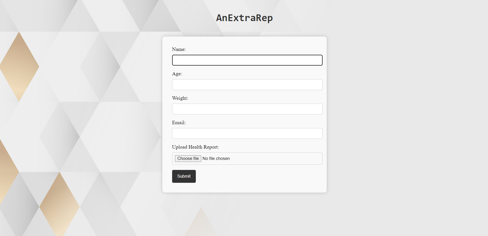
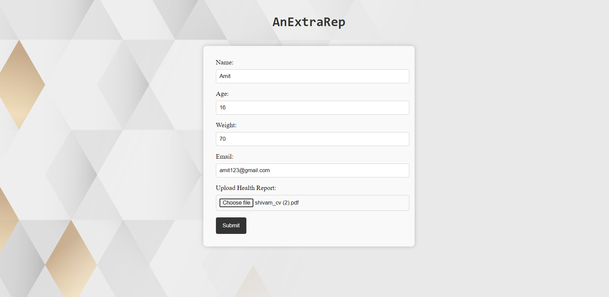
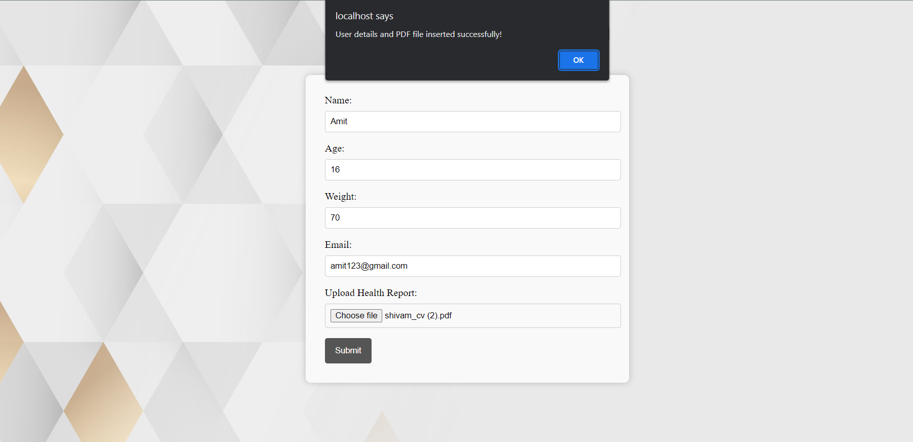
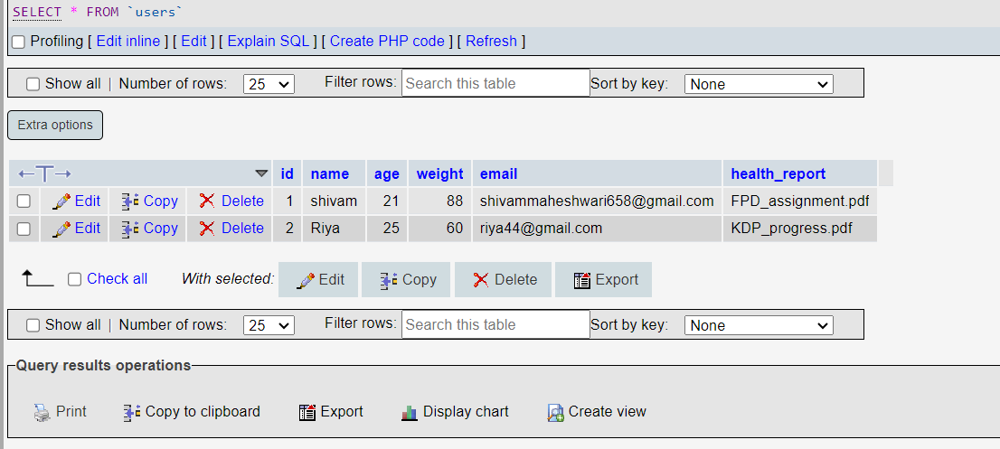
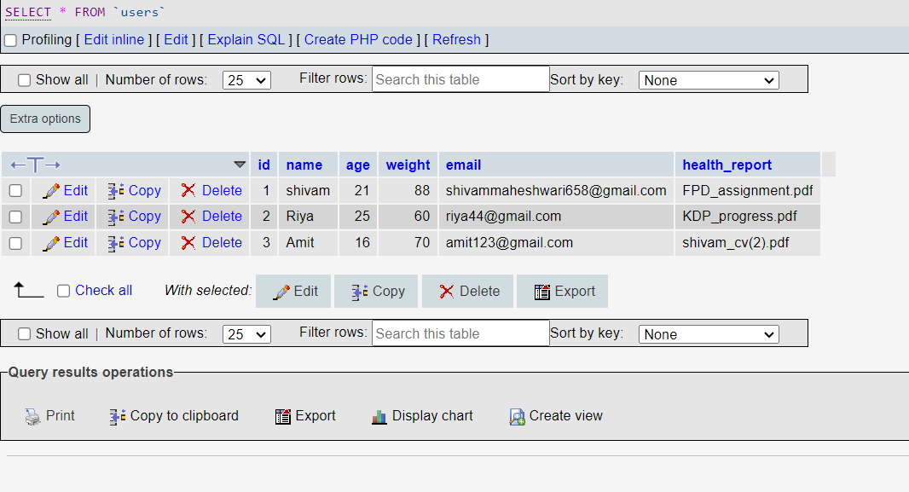
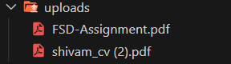

# AnExtraRep - Health Report Submission System

AnExtraRep is a web application designed to allow users to submit their health reports. This repository contains the source code for the project.

## Technologies Used

The project is built using the following technologies:

- HTML
- CSS
- JavaScript
- PHP
- MySQL

## Screenshots

### Homepage

### Form Filled

### Submission Successful

### Database Before Submission

### Database After Submission

### Uploads Folder

## How to Run the Project

To run the project locally, follow these steps:

1. Clone the repository to your local machine or download the source code as a ZIP file.
2. Make sure you have a web server installed (e.g., Apache) and PHP installed on your machine.
3. Create a MySQL database named "health_report" and import the provided SQL file (`database.sql`) to set up the required table.
4. Copy the project files to the document root directory of your web server.
5. Update the database connection details in the `insert.php` file to match your database configuration.
6. Start your web server.
7. Open a web browser and navigate to the URL of your local server to access the application.

Note: The screenshots provided above are for illustrative purposes only and may vary based on your specific setup.

